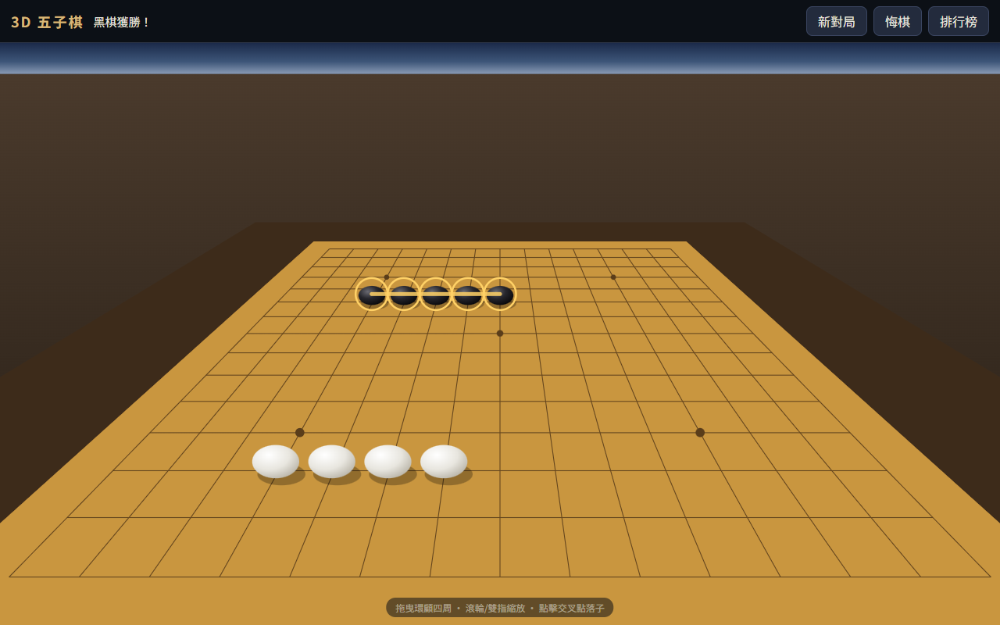
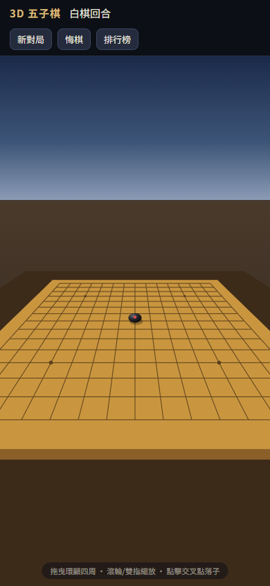

# 3D 五子棋 — 第一人稱對弈

純 HTML + CSS + JavaScript + SVG 打造的 3D 五子棋，零依賴、零建置、零框架。
以第一人稱視角坐在棋桌前對弈，可拖曳環顧、縮放視角，支援雙人對戰與電腦對戰。



## 特色

- **純 SVG 3D 渲染** — 不用 WebGL、不用 Canvas、不用任何函式庫。自製透視相機（yaw/pitch 旋轉矩陣 + 透視除法）將棋盤、棋子投影成 SVG 圖形，棋子依深度排序繪製
- **第一人稱視角** — 拖曳環顧四周、滾輪或雙指縮放，像真的坐在棋桌前
- **雙人對戰 / 與電腦對戰** — AI 採啟發式評估：連五直取、封堵衝四與活三、雙威脅複合加權，可選執黑或執白
- **無限悔棋** — 悔到空盤為止；電腦模式一次退兩手；勝局悔棋可復活繼續下
- **排行榜與親筆簽名** — 獲勝後可在簽名板上手寫簽名，連同名字、手數、用時存入 `localStorage`
- **多裝置支援** — Pointer Events 統一處理滑鼠與觸控，響應式排版，手機直接玩



## 線上遊玩

**https://tonnychiulab.github.io/555/**

原始碼：https://github.com/tonnychiulab/555

## 本機執行

不需要安裝任何東西，直接用瀏覽器開啟 `index.html` 即可。

若想用本機伺服器：

```bash
npx serve .
# 或
python -m http.server 8000
```

## 操作方式

| 操作 | 桌面 | 行動裝置 |
|---|---|---|
| 落子 | 點擊交叉點 | 輕觸交叉點 |
| 環顧視角 | 按住拖曳 | 單指拖曳 |
| 縮放 | 滾輪 | 雙指開合 |
| 悔棋 | 「悔棋」按鈕或 `Ctrl+Z` / `U` | 「悔棋」按鈕 |

## 部署到 GitHub Pages

1. 將本專案推上 GitHub：

   ```bash
   git init
   git add .
   git commit -m "3D Gomoku"
   git remote add origin https://github.com/tonnychiulab/555.git
   git push -u origin main
   ```

2. 到 repo 的 **Settings → Pages**
3. **Source** 選擇 `Deploy from a branch`，Branch 選 `main`、資料夾選 `/ (root)`，按 **Save**
4. 等待約一分鐘，頁面就會發佈在 `https://tonnychiulab.github.io/555/`

純靜態網站，不需要任何 build step 或 GitHub Actions 設定。

## 專案結構

```
├── index.html    # 頁面結構、SVG 圖層與漸層定義、彈窗
├── style.css     # 版面與響應式樣式
├── engine.js     # 遊戲引擎：棋盤狀態、勝負判定、悔棋、AI（UMD，可供 Node 測試）
├── main.js       # 3D 投影、SVG 渲染、視角操作、簽名板、排行榜
└── favicon.svg   # 網站圖示
```

## 技術細節

- **透視投影**：相機以球座標（yaw、pitch、distance）繞棋盤中心運動，世界座標經 `Ry(-θ)`、`Rx(φ)` 旋轉後做透視除法投影到螢幕
- **命中測試**：每次渲染快取 225 個交叉點的螢幕座標，點擊時找最近點並以「投影後格距的 55%」為容許半徑，遠近格子的點擊精度一致
- **手勢區分**：位移超過 7px 視為拖曳視角，否則視為落子，拖曳不會誤觸
- **簽名**：以 Pointer Events 收集筆跡座標，存成 polyline 點陣列，在排行榜以縮小的 SVG 重繪

## 測試

引擎邏輯（勝負判定、悔棋、AI 行為）可在 Node 直接測試，`engine.js` 為 UMD 模組：

```js
const E = require('./engine.js');
const g = E.createGame();
E.place(g, 7, 7);
E.aiMove(g); // => { x, y }
```

開發過程以 Node 單元測試（23 項）與 Playwright 無頭瀏覽器測試（26 項，含桌面點擊、拖曳、觸控、簽名上榜、重新整理持久化）全數通過。

## 授權

[MIT License](LICENSE)
